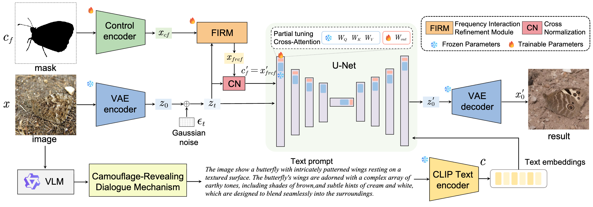

## [AAAI 2026 Poster] Text-guided Controllable Diffusion for Realistic Camouflage Images Generation (CT-CIG)
---
<center><font face="黑体">Yuhang Qian, Haiyan Chen, Wentong Li, Ningzhong Liu, Jie Qin</font></center>

<br/>

<center><font face="黑体">Nanjing University of Aeronautics and Astronautics</font></center>

<br/>

 [](https://arxiv.org/abs/2511.20218) 

### Overview
<hr style="border: 0; height: 1.5px; background-color: #d0d7de;">

This is the pytorch implementation of the AAAI 2026 paper "Text-guided Controllable Diffusion for Realistic Camouflage Images Generation".




### News
<hr style="border: 0; height: 1.5px; background-color: #d0d7de;">

+ 🔥**2025.11.28**🔥: **Full code**, **checkpoints**, **generated results** and **tutorials** are released!
+ **2025.11.26:** Upload the **data json** files, the **basic code** about model architecture, training and inference.
+ **2025.11.25:** Paper submitted to [arxiv](https://arxiv.org/abs/2511.20218).
+ **2025.11.08:** CT-CIG has been accepted to **AAAI 2026** !

### Tutorials
<hr style="border: 0; height: 1.5px; background-color: #d0d7de;">

#### 1. Environments Setup

Our Text-guided controllable diffusion for generating realistic camouflage images requires two different python environments, one is for CRDM that takes Qwen2.5-VL for text prompt generation, and the other is for deploying CT-CIG framework. We suggest using conda/miniconda to manage these two distinct environments.

**Environment setup for CT-CIG Diffusion**

```python
#cuda==11.8
conda create --prefix=/path/to/env_name python=3.8     #install a new environment called "env_name" to location "/path/to"

#set the path to conda environment list (only config once when you just install conda/miniconda)
conda config --append envs_dirs /path/to  

conda activate env_name
# specify cuda version for torch
pip install torch==2.4.1 torchvision==0.19.1 torchaudio==2.4.1 --index-url https://download.pytorch.org/whl/cu118
cd ControlCamouflage-Train
pip install -r requirements.txt     #related dependencies, based on ControlNext
```


**Environment setup for Qwen2.5-VL**

If your device supports Ollama, it's fortunately that Ollama includes the Qwen2.5-VL. All you need to do is just install Ollama, and run **test_qwen_ollama.py** in **"Qwen_inference"** folder, with a few additional packages (supports python3.9+).

If you want to deploy Qwen2.5-VL on your local device manually, below is the guidline.
```python
#cuda==12.4
conda create --prefix=/path/to/env_name python=3.12

conda activate env_name
#specify cuda version for torch
pip install torch==2.6.0 torchvision==0.21.0 torchaudio==2.6.0 --index-url https://download.pytorch.org/whl/cu124

cd Qwen_inference
pip install -r requirements.txt     #related dependencies for deploying Qwen
```

Or you can see this [document](https://connectaman.hashnode.dev/fine-tuning-the-qwen25-7b-vl-instruct-model-a-comprehensive-guide) for reference, which is originally built for finetuning Qwen2.5-VL.

#### 2. Collecting Dataset
Our experiments were conducted on the LAKE-RED dataset, which integrates popular camouflage images for COD task, such as COD10K, CAMO, NC4K. LAKE-RED dataset is available at the author's [github repository](https://github.com/PanchengZhao/LAKE-RED), in section 2 .

We have an extra operation on the LAKE-RED train and validation images by adding semi-transparent object contours, which is used for enhancing VLM understanding about camouflaged objects. You can organize datasets, adjust dataset folders and run **add_contour.py** to generate outlined images and use them as the input of VLM for obtaining text prompts.

```python
python add_contour.py
```

#### 3. Generating Text-prompts

Both **add_contour** in Step 2 and Step3 are actually not necessary if you only want to perform CT-CIG demo and training. We have already provided the collected text prompt json files in the **json_data** that can be utilized directly. In this case, see step 4 and step 5 on model inference and training.

If you want to generate text prompts via CRDM, here is the guideline. We provide two versions of VLM-based CRDM in the **Qwen_inference** folder, one is based on Ollama, and the other is deploying Qwen2.5-VL in your local device.

For Ollama-based, specify the following args in **test_qwen_ollama.py**
```python
--image_path      # path to the image folder (outlined version of LAKERED train or validation)
--output_json     # output json file that stores the vlm reponses
```

and simply run
```python 
python test_qwen_ollama.py
```

For local deployment, specify the **cam_image_folder** and **output_json_path** in **vl25_mask_camed.py**，and simply run
```python
python vl25_mask_camed.py
```
However in this case, the output json file contains the entire conversation history for each image entry. You need to manually write a script to convert the json entry into this format:
```python
{
"mask": mask_name,      # control signal
"image": img_name,      # RGB image
"detail_prompt": "XXXX",      # prompt used during train (T_detail)
"prompt": "XXX"         # prompt used during inference (T_simple)               
}
```

You will be able to perform CT-CIG inference and train once the text prompts are collected.

#### 4. Inference

The Inference implentation lies in the **ControlCamouflage** folder.CT-CIG comprises VAE, SDXL-based unet, and controlnet (FIRM is integrated before unet via monkey patch, which supports loading pre-trained weights normally even more modules are attached). The VAE and the SDXL is pre-trained, and their related weights will be automatically downloaded once you launch the inference file **test_CTCIG.py**. The controlnet needs training from scratch, and the cross-attenion projections in the unet, along with the FIRM module also require training. The related weights are saved as **"controlnet"** safetensor and **"unet"** safetensor (with FIRM integrated).

We provide our result checkpoints for CT-CIG to support you for quick inference. We also provided our generated results on LAKE-RED validation for quick comparison, related resources are available:

unet weights|controlnet weights|generated results
|-|-|-|
[Google Drive](https://drive.google.com/file/d/1DLaL_qzemGjM3EVL3FDXRWEpdKqbHrsA/view?usp=drive_link)|[Google Drive](https://drive.google.com/file/d/12JW_gziPNX1evfq9PA5GyFMfLFBx5k4w/view?usp=drive_link)|[Google Drive](https://drive.google.com/file/d/1sHED3jNTlwaIfFBLjlv77K1sp3bbDma0/view?usp=drive_link)


```sh
#!/bin/bash
export CUDA_VISIBLE_DEVICES=0       # specify which CUDA device you will use on your server
python test_CTCIG.py \
    --pretrained_model_name_or_path "stabilityai/stable-diffusion-xl-base-1.0" \    # pre-trained SDXL
    --unet_model_name_or_path XXX \     # path for unet safetensor checkpoint
    --controlnet_model_name_or_path XXX \ # path for controlnet safetensor checkpoint
    --controlnet_scale "1.2" \      
    --vae_model_name_or_path "madebyollin/sdxl-vae-fp16-fix" \    # pre-trained VAE
    --output_dir  "test_output"\    # output result folder
    --width "512" \           # size of generated images
    --height "512" \
    --load_weight_increasement \
    --jsonl_path XXX \  # the path for the text prompt json file
    --image_folder "XXX/LAKERED_DATASET/validation/images" \ # the path for RGB images (actually not used)
    --mask_folder "XXX/LAKERED_DATASET/validation/masks" \ # the path for control signals (this is the only image input during inference for control signal, RGB images will not be used)
```
Please specify the above args and start inference by running:
```sh
bash run_test.sh
```

In case you want to perform debugging, we provide the vscode json for you in the **.vscode** folder. 

#### 5. Training CT-CIG

The Inference implentation lies in the **ControlCamouflage-Train** folder Following inference, CI-CIG comprises VAE, SDXL-base unet (FIRM attached), and the controlnet. Our goal is to training the controlnet, the cross-attention projectors in unet, and the FIRM, and two safetensor checkpoints will be saved, i.e. **unet** and **controlnet**.

Our program for CT-CIG training is launched via the **accelerate** package, which enables parallelizing data into multiple GPU devices to speed up training. In this case, we use a shell script to launch the training file **train_CTCIG.py**. 

```sh
#!/bin/bash
export CUDA_VISIBLE_DEVICES=3,4,5,6         # assign GPU IDs to specify which devices to use
accelerate launch --num_processes=4 train_CTCIG.py \  # keep in sync with GPU devices
      # load pretrained SDXL and VAE
    --pretrained_model_name_or_path "stabilityai/stable-diffusion-xl-base-1.0" \
    --pretrained_vae_model_name_or_path "madebyollin/sdxl-vae-fp16-fix" \
    --variant fp16 \    # weight dtype, we use float16
    --use_safetensors \
    --output_dir "train/training_exp" \   # output folder for training logs, including losses, validation images during training and checkpoints
    --checkpoint_dir "train/training_exp/checkpoints" \
    --logging_dir "logs" \
    --resolution 512 \  # training image size
    --num_train_epochs 80 \   # number of
    --controlnet_lr_decay_start_epoch 40 \  # learning rate decay for controlnet
    --controlnet_lr_decay_end_epoch 60 \
    --validation_steps 1000 \       # how many steps to perform an intimediate validation
    --checkpointing_steps 10000 \   # how many steps to save an intimediate checkpoint (in any case the final checkpoint will be automatically saved)
    --set_grads_to_none \
    --proportion_empty_prompts 0.1 \
    --controlnet_scale_factor 1.2 \
    --save_weights_increaments "True" \
    --mixed_precision fp16 \
    --custom_jsonl_file XXXX \ # path of the generated json file for LAKE-RED-train
    # training dataset dictionary
    --masks_folder XXX/LAKERED_DATASET/train/masks \
    --images_folder XXX/LAKERED_DATASET/train/images \
    --image_column "image" \
    --conditioning_image_column "conditioning_image" \
    --caption_column "text" \
    --validation_prompt "Brown owl on gravel with brown and white speckled feathers" \
    --validation_image "examples/camouflage/COD_CAMO_camourflage_00208.png" \
    --learning_rate 5e-6 \    # learning rate for the unet
    --positive_prompt_prefix "photorealistic, high quality, camouflaged" \
    --report_to tensorboard \
    # more args are available and can be valued in train_CTCIG.py
```

Please specify the above args and start training CT-CIG by running:
```sh
bash run_train.sh
```
In case you want to perform debugging, we also provide the vscode json for you in the **.vscode** folder, plese refer to name **ControlNext_accelerate_debug**, you can set **"--num_processes=1"** that makes accelerate works only on a single gpu. You can also set **--train_batch_size=1**, **--num_train_epochs=1** for quick debugging.

#### 6. Eval
Evaluation metrics mentioned in our CT-CIG are FID, KID, and CLIP-Score.

FID and KID are calculated taking 5066 Camouflage images in the LKAE-RED **COD10K_CAM** subset as reference. The implementation and tutorial of FID and KID calculation are available in the [LAKE-RED](https://github.com/PanchengZhao/LAKE-RED) repository (**section 6**). 

CLIP-Score calculates the similarity and content-alignment between the image and the paired text prompt. See [this](https://github.com/Taited/clip-score) for detailed instruction.


### Contact
<hr style="border: 0; height: 1.5px; background-color: #d0d7de;">

For any questions about CT-CIG, feel free to contact me via these emails:
qyh1395@gmail.com
qianyuhang@nuaa.edu.cn

### Acknowledgements
<hr style="border: 0; height: 1.5px; background-color: #d0d7de;">

This repository is built upon and borrow heavily from [ControlNext](https://github.com/dvlab-research/ControlNeXt "ControlNext"), we acknowledge a lot to their contribution.


### Citation
<hr style="border: 0; height: 1.5px; background-color: #d0d7de;">

```
@article{qian2025text,
  title={Text-guided Controllable Diffusion for Realistic Camouflage Images Generation},
  author={Qian, Yuhang and Chen, Haiyan and Li, Wentong and Liu, Ningzhong and Qin, Jie},
  journal={arXiv preprint arXiv:2511.20218},
  year={2025}
}
```
